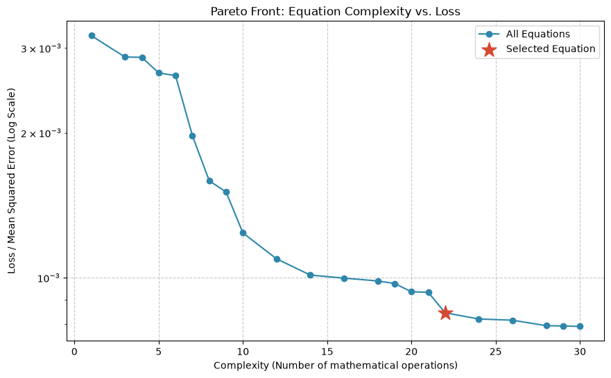
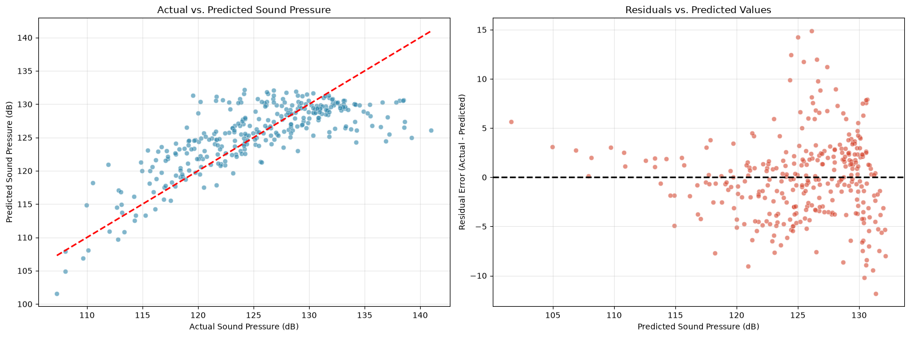

# Symbolic Regression in a Physics-Driven Engineering Context: Airfoil Self-Noise Prediction

## Project Idea

This repository focuses on discovering compact, interpretable mathematical expressions that can predict airfoil self-noise from aerodynamic and geometric features. Designed as a fast 1–2 day project, it explores the critical engineering trade-off between black-box machine learning accuracy and mathematical interpretability.

## Accuracy vs. Interpretability

During the benchmarking, black-box models like Random Forest and XGBoost achieved high $R^2$ scores (the latter ~0.80 - 0.83). However, these algorithms act as opaque black-box systems that hide the explanation behind their predictions.

By utilizing **Symbolic Regression (PySR)**, we accepted a lower predictive score to extract an explicit, human-readable mathematical equation.

## The Discovered Equation

After evaluating the Pareto front for optimal complexity vs. loss, the raw equation generated by our final PySR model (at Complexity 22) is:

`-sqrt(frequency)*(0.00515589997449654*chord_length + 0.0536463245883744*suction_side_displacement_thickness + 0.02464212/free_stream_velocity) + 4.9272275 - 0.7817246/(chord_length*frequency)`

Translated into standard mathematical notation on the log-transformed target scale:

$$Target_{log}=-\sqrt{frequency}\cdot\left(0.00516\cdot chord+0.05365\cdot thickness+\frac{0.02464}{velocity}\right)+4.92723-\frac{0.78172}{chord\cdot frequency}$$

*(To retrieve the final Decibel prediction, simply apply the inverse transformation: $y_{dB}=\exp(Target_{log})-1$)*

## Benchmark Results

All models were evaluated using a strict `GroupShuffleSplit` on the physical experiment identifiers to prevent data leakage. The target variable was transformed using `log1p` during training to correct skewness, then inverse-transformed to calculate metrics on the original Decibel (dB) scale.

| Model | $R^2$ Score | Mean Absolute Error (MAE) | Type |
| :--- | :--- | :--- | :--- |
| **Linear Regression** | 0.375 | 3.998 dB | Baseline |
| **PySR (Best Eq)** | 0.595 | 3.193 dB | White-box |
| **XGBoost** | 0.801 | 2.091 dB | Black-box |
| **Random Forest** | 0.838 | 1.869 dB | Black-box |

## Visual Diagnostics

### Pareto Front (Complexity vs. Loss)
 

### Residual Analysis

**Note on Residuals:** The residual plot exhibits a strange shape. This is expected behavior, the model was trained to minimize Mean Squared Error on the `log1p` scale. When the inverse transformation (`np.expm1`) is applied to calculate real-world Decibels, minor errors on the log scale are exponentially magnified at higher sound pressures. Furthermore, a compact physical equation naturally struggles to capture the highly non-linear variances of extreme aerodynamic limits compared to a black-box model.

**Note on Developer:** I have no deep expertise in aerodynamics, so the discovered equation may not be physically meaningful. A better feature selection, equation simplification, or domain knowledge integration could improve the physical relevance of the discovered formula. However, it is a good starting point for further exploration and refinement.

## Project Structure

- **`data_prep.py`**: Dataset loading, safe grouped train/test splitting, and feature normalization.
- **`evaluation.py`**: Baseline model comparison, target transformation tests, and grid search.
- **`train.py`**: Final symbolic regression training script and model serialization.
- **`eda.ipynb` & `final_analysis.ipynb`**: Data exploration, equation inspection, and residual plotting.

## How to Run

0. **Use a virtual environment if you want:**
   `python -m venv .venv`
   `source .venv/bin/activate` (Linux/Mac) or `.venv\Scripts\activate` (Windows)

1. **Install Dependencies:**
   Ensure you have Python 3.10+ installed. Install the required libraries:
   `pip install -r requirements.txt`

2. **Train the Model:**
   Run the main training script to fetch the data, fit the PySR model, and generate the `final_sr_model.pkl` and `final_equation.txt` files:
   `python train.py`

   The final equation will be saved in `final_equation.txt`, and the trained PySR model will be saved to `final_sr_model.pkl`. You can use `model.latex()` to view the equation in LaTeX format; or just transcribe the equation from the text file. `final_analysis.ipynb` also allows you to see the final equation in LaTeX format and evaluate model performance.

## Dataset

The Airfoil Self-Noise dataset contains measurements of airfoil geometry and operating conditions, with the target representing the scaled sound pressure level.

**Source:** [UCI Machine Learning Repository - Airfoil Self-Noise](https://archive.ics.uci.edu/dataset/291/airfoil+self+noise)

## Reference Papers

* Angelis, D., Sofos, F., & Karakasidis, T. (2023). Artificial Intelligence in Physical Sciences: Symbolic Regression Trends and Perspectives. *Archives of Computational Methods in Engineering*, 1 - 21. [https://doi.org/10.1007/s11831-023-09922-z](https://doi.org/10.1007/s11831-023-09922-z)
* Makke, N., & Chawla, S. (2022). Interpretable scientific discovery with symbolic regression: a review. *Artificial Intelligence Review*, 57, 1-38. [https://doi.org/10.1007/s10462-023-10622-0](https://doi.org/10.1007/s10462-023-10622-0)